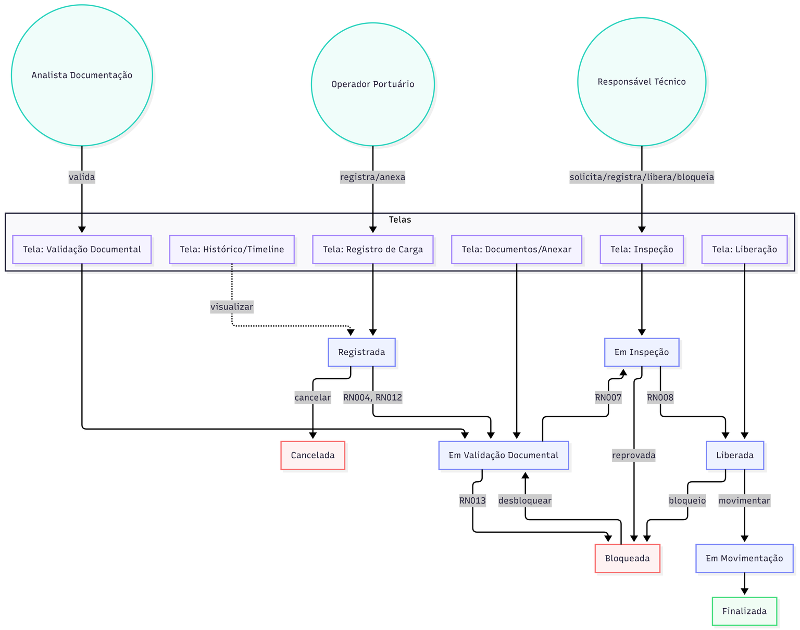

# Casos de uso (BDD)

### Convenções

- **US** = User Story (história de usuário)
- **RN** = Regra de Negócio (transversal, listada na seção 6)
- **RNF** = Requisito Não Funcional (transversal, listado na seção 7)

### Fluxo de status da carga



- "Bloqueada" pode ocorrer a partir de qualquer estado ativo e retorna ao estado anterior após desbloqueio.
- "Cancelada" e "Finalizada" são estados terminais.

---

## Épico EP001 — Gestão de Produtos Químicos

**Como** administrador do sistema, **quero** manter um catálogo íntegro e ativo de produtos químicos **para** que toda carga registrada seja associada a um produto válido e classificado corretamente por risco.

---

### US001 — Cadastrar produto químico

**Eu como** administrador do sistema **quero** cadastrar um novo produto químico **para** que ele possa ser associado a cargas químicas futuras.

**Cenário 01 — Cadastro com dados válidos**
Dado que estou autenticado como administrador
E acesso a tela de cadastro de produtos químicos
Quando informo nome, classe de risco, unidade de medida e estado físico válidos
E confirmo o cadastro
Então o sistema persiste o produto com status "Ativo"
E exibe mensagem "Produto químico cadastrado com sucesso"

**Comportamento esperado:** o sistema deve gerar identificador único, registrar data/hora de criação e autor, e iniciar o produto no status "Ativo".

**Critérios de aceite:**
1. Nome deve ser único no catálogo entre produtos ativos.
2. Classe de risco é obrigatória.
3. Estado físico deve pertencer ao enum: sólido, líquido, gasoso.
4. Produto criado com status "Ativo" por padrão.
5. Data de criação e autor devem ser registrados.

**Cenário 02 — Tentativa de cadastro sem nome**
Dado que estou na tela de cadastro
Quando tento salvar sem informar o nome
Então o sistema não persiste o produto
E exibe mensagem "Nome do produto químico é obrigatório"

**Critérios de aceite:**
1. Sistema não deve prosseguir com o cadastro.
2. Mensagem clara indicando o campo obrigatório.

**Cenário 03 — Tentativa de cadastro sem classe de risco**
Dado que estou na tela de cadastro
E preenchi nome mas não selecionei classe de risco
Quando tento salvar
Então o sistema não persiste o produto
E exibe mensagem "Classe de risco é obrigatória"

**Critérios de aceite:**
1. Bloqueio de persistência.
2. Mensagem específica sobre o campo.

**Cenário 04 — Nome duplicado**
Dado que já existe no catálogo um produto ativo com o mesmo nome
Quando tento cadastrar novo produto com o mesmo nome
Então o sistema não persiste o produto
E exibe mensagem "Já existe produto químico ativo com este nome"

**Critérios de aceite:**
1. Bloqueio de duplicidade em produtos ativos.
2. Comparação case-insensitive com trim.

**Requisitos não funcionais vinculados:** RNF001, RNF002, RNF005.

---

### US002 — Inativar produto químico

**Eu como** administrador do sistema **quero** inativar um produto químico que não deve mais ser utilizado **para** impedir seu uso em novas cargas, preservando o histórico das cargas anteriores.

**Cenário 01 — Inativação bem-sucedida**
Dado que existe um produto químico ativo no catálogo
Quando seleciono o produto e clico em "Inativar"
E confirmo a ação
Então o sistema muda o status do produto para "Inativo"
E registra data/hora e autor da inativação
E o produto deixa de aparecer nas listas de seleção para novas cargas

**Critérios de aceite:**
1. Status muda para "Inativo".
2. Cargas já registradas com esse produto permanecem intactas.
3. Produto não aparece em listas de seleção para novas cargas.
4. Consulta histórica ainda retorna o produto.

**Cenário 02 — Tentativa de usar produto inativo em nova carga**
Dado que um produto está com status "Inativo"
Quando tento associá-lo a uma nova carga
Então o sistema bloqueia
E exibe "Produto químico está inativo e não pode ser usado em novas cargas"

**Critérios de aceite:**
1. Produto inativo não aparece em listas de seleção.
2. Backend também bloqueia (defesa em profundidade).

**Requisitos não funcionais vinculados:** RNF001, RNF005.

---

## Épico EP002 — Registro e Ciclo de Vida da Carga Química

**Como** operador portuário, **quero** registrar cargas químicas com todos os dados obrigatórios e conduzi-las por um fluxo de status auditável **para** que a operação seja rastreável e conforme com as regras de segurança.

---

### US003 — Registrar carga química

**Eu como** operador portuário **quero** registrar uma nova carga química informando produto, quantidade, classificação de risco e responsável técnico **para** iniciar o fluxo de liberação da carga.

**Cenário 01 — Registro com dados válidos**
Dado que estou autenticado como operador portuário
E existe pelo menos um produto químico ativo no catálogo
E existe pelo menos um responsável técnico ativo cadastrado
Quando informo produto químico ativo, quantidade maior que zero, classificação de risco e responsável técnico
E confirmo o registro
Então o sistema cria a carga com status "Registrada"
E gera identificador único
E exibe mensagem "Carga registrada com sucesso"

**Comportamento esperado:** ao registrar, o sistema deve validar todas as regras no ato (produto ativo, quantidade positiva, classificação informada, RT válido). A carga entra no fluxo com status inicial "Registrada".

**Critérios de aceite:**
1. Identificador único gerado.
2. Data/hora e autor do registro persistidos.
3. Status inicial obrigatoriamente "Registrada".
4. Todas as validações executadas antes da persistência.
5. Snapshot dos dados do produto no momento do registro (para preservar auditoria).

**Cenário 02 — Tentativa de registro sem produto químico**
Dado que estou na tela de registro
E não selecionei nenhum produto químico
Quando tento salvar
Então o sistema bloqueia
E exibe "Produto químico é obrigatório para registrar carga"

**Critérios de aceite:**
1. Bloqueio no domínio.
2. Mensagem clara.

**Cenário 03 — Tentativa de registro com produto inativo**
Dado que existe um produto químico com status "Inativo"
Quando tento associá-lo a uma nova carga
Então o sistema bloqueia
E exibe "Produto químico está inativo e não pode ser usado em novas cargas"

**Critérios de aceite:**
1. Produto inativo não aparece em listas de seleção.
2. Backend rejeita a tentativa mesmo por acesso direto.

**Cenário 04 — Tentativa de registro com quantidade zero ou negativa**
Dado que estou registrando uma carga
Quando informo quantidade 0 ou negativa
Então o sistema bloqueia
E exibe "Quantidade da carga deve ser maior que zero"

**Critérios de aceite:**
1. Validação numérica no domínio.
2. Aceita valores decimais positivos.

**Cenário 05 — Tentativa de registro sem classificação de risco**
Dado que estou registrando uma carga
E não informei classificação de risco
Quando tento salvar
Então o sistema bloqueia
E exibe "Classificação de risco é obrigatória"

**Critérios de aceite:**
1. Campo obrigatório validado no domínio.
2. Mensagem clara.

**Cenário 06 — Tentativa de registro sem responsável técnico**
Dado que estou registrando uma carga
E não vinculei responsável técnico
Quando tento salvar
Então o sistema bloqueia
E exibe "Responsável técnico é obrigatório para toda carga química"

**Critérios de aceite:**
1. Só permite seleção de RTs ativos.
2. Bloqueio no domínio.

**Requisitos não funcionais vinculados:** RNF001, RNF002, RNF003, RNF005.

---

### US004 — Atualizar status da carga

**Eu como** operador portuário ou responsável técnico **quero** atualizar o status da carga conforme o fluxo definido **para** refletir o estágio real da operação e permitir auditoria.

**Cenário 01 — Transição válida**
Dado que existe uma carga em status "Registrada"
E a documentação já foi anexada
Quando o Analista de Documentação inicia a validação
Então o sistema muda status para "Em Validação Documental"
E registra evento no histórico

**Critérios de aceite:**
1. Só usuários com perfil autorizado disparam a transição.
2. Registro no histórico com autor, timestamp e motivo (opcional).
3. Evento imutável.

**Cenário 02 — Tentativa de transição inválida**
Dado que uma carga está em status "Registrada"
Quando alguém tenta transicioná-la diretamente para "Liberada"
Então o sistema bloqueia
E exibe "Transição de status inválida"

**Critérios de aceite:**
1. Máquina de estados implementada no domínio.
2. Mensagem descritiva.
3. Log de tentativa inválida com autor.

**Requisitos não funcionais vinculados:** RNF001, RNF002, RNF005.

---

### US005 — Cancelar carga química

**Eu como** operador portuário ou responsável técnico **quero** cancelar uma carga química **para** encerrá-la formalmente quando ela não for mais movimentada.

**Cenário 01 — Cancelamento válido**
Dado que existe uma carga em status diferente de "Finalizada" e "Cancelada"
Quando executo "Cancelar Carga" informando motivo obrigatório
Então o sistema muda status para "Cancelada"
E registra evento com autor, timestamp e motivo
E a carga fica em estado terminal

**Critérios de aceite:**
1. Motivo obrigatório.
2. Estado terminal — nenhuma transição posterior permitida.
3. Autor e timestamp registrados.

**Cenário 02 — Tentativa de cancelar carga finalizada**
Dado que a carga tem status "Finalizada"
Quando tento cancelar
Então o sistema bloqueia
E exibe "Carga já finalizada não pode ser cancelada"

**Critérios de aceite:**
1. Estados terminais protegidos.
2. Mensagem descritiva.

**Cenário 03 — Tentativa de liberar carga cancelada**
Dado que a carga está em status "Cancelada"
Quando alguém tenta liberá-la
Então o sistema bloqueia
E exibe "Carga cancelada não pode ser liberada"

**Critérios de aceite:**
1. RN006 aplicada.
2. Log de tentativa.

**Requisitos não funcionais vinculados:** RNF001, RNF005.

---

## Épico EP003 — Documentação Obrigatória

**Como** analista de documentação, **quero** validar tipo e vigência de todos os documentos obrigatórios de uma carga **para** que nenhuma carga seja liberada sem conformidade.

---

### US006 — Anexar documentação obrigatória à carga

**Eu como** operador portuário ou analista de documentação **quero** anexar documentos obrigatórios a uma carga química **para** viabilizar sua validação e liberação.

**Cenário 01 — Anexo bem-sucedido**
Dado que existe uma carga com status "Registrada" ou posterior
E possuo um arquivo válido
Quando seleciono o tipo de documento dentre os documentos obrigatórios exigidos pelo Risco da Classificação de Risco do produto da carga
E anexo o arquivo informando a data de validade
Então o sistema armazena o documento
E o vincula à carga
E registra evento no histórico

**Comportamento esperado:** a lista de tipos disponíveis para anexo não é um enum fixo — vem da cadeia Classificação de Risco → Risco → Documento Obrigatório (RN019), calculada em snapshot no momento do registro da carga (RN012), para não sofrer efeito retroativo de mudanças posteriores no catálogo.

**Critérios de aceite:**
1. Tipos de arquivo aceitos configuráveis (PDF, JPG, PNG por padrão).
2. Tamanho máximo configurável (10 MB por padrão).
3. Tipo do documento é selecionado dentre os documentos obrigatórios do catálogo exigidos pelo Risco vinculado à Classificação de Risco do produto da carga (RN019) — não é texto livre.
4. Data de validade obrigatória quando o Documento Obrigatório correspondente exige validade (`exigeDataDeValidade = true`).

**Cenário 02 — Documento com data de validade no passado**
Dado que estou anexando um documento
Quando informo data de validade anterior à data atual
Então o sistema aceita o anexo mas marca como "Vencido"
E o documento não conta para a checagem de completude

**Critérios de aceite:**
1. Documento vencido permitido apenas para histórico.
2. Marcado como "Vencido".
3. Não conta para completude documental.

**Cenário 03 — Tipo de arquivo inválido**
Dado que estou anexando um documento
Quando envio um arquivo de tipo não permitido
Então o sistema rejeita
E exibe "Tipo de arquivo não permitido"

**Critérios de aceite:**
1. Validação por MIME type e extensão.
2. Nenhum byte é persistido.

**Requisitos não funcionais vinculados:** RNF002, RNF003, RNF005.

---

### US007 — Validar documentação da carga

**Eu como** analista de documentação **quero** validar se a carga possui todos os documentos obrigatórios vigentes **para** liberar ou bloquear a continuidade do fluxo.

**Cenário 01 — Documentação completa e vigente**
Dado que uma carga possui todos os documentos obrigatórios com validade vigente
Quando executo "Validar Documentação"
Então o sistema muda status para "Documentação Válida"
E libera para a próxima etapa
E registra evento no histórico

**Comportamento esperado:** "documentos obrigatórios" da carga é a lista de Documento Obrigatório exigida pelo Risco associado à Classificação de Risco do produto (RN019) — não uma lista genérica fixa no código.

**Critérios de aceite:**
1. Todos os documentos exigidos pela cadeia Classificação de Risco → Risco → Documento Obrigatório (RN019) precisam existir e estar vigentes.
2. Evento registrado no histórico.

**Cenário 02 — Falta de documento obrigatório**
Dado que uma carga não possui todos os documentos exigidos
Quando executo "Validar Documentação"
Então o sistema bloqueia a validação
E exibe a lista de documentos ausentes
E o status permanece em "Em Validação Documental"

**Critérios de aceite:**
1. Lista explícita dos documentos ausentes.
2. Não permite avançar de status.

**Cenário 03 — Documento vencido**
Dado que a carga possui documento com validade expirada
Quando executo "Validar Documentação"
Então o sistema bloqueia
E exibe "Documento vencido"

**Critérios de aceite:**
1. Comparação com data atual do sistema.
2. Mensagem indica o documento vencido.

**Requisitos não funcionais vinculados:** RNF001, RNF002, RNF005.

---

## Épico EP004 — Inspeção e Liberação

**Como** responsável técnico, **quero** conduzir inspeção formal e liberação da carga **para** garantir que ela está apta a ser movimentada com segurança.

---

### US008 — Solicitar inspeção

**Eu como** responsável técnico **quero** solicitar formalmente uma inspeção para uma carga **para** validar tecnicamente antes da liberação.

**Cenário 01 — Solicitação válida**
Dado que existe uma carga com documentação válida
Quando solicito inspeção informando data prevista
Então o sistema muda status para "Em Inspeção"
E registra evento no histórico

**Critérios de aceite:**
1. Só permite solicitar em cargas com documentação já validada.
2. Data prevista maior ou igual à data atual.

**Cenário 02 — Tentativa em carga não elegível**
Dado que a carga está em status "Registrada"
Quando tento solicitar inspeção
Então o sistema bloqueia
E exibe "Carga precisa ter documentação validada antes da inspeção"

**Critérios de aceite:**
1. Regra explícita no domínio.
2. Mensagem descritiva.

**Requisitos não funcionais vinculados:** RNF001, RNF005.

---

### US009 — Registrar resultado da inspeção

**Eu como** responsável técnico **quero** registrar o resultado formal de uma inspeção **para** determinar o próximo passo da carga no fluxo.

**Cenário 01 — Inspeção aprovada**
Dado que existe uma carga em status "Em Inspeção"
Quando registro resultado "Aprovada"
Então o sistema persiste o resultado
E permite que a carga seja liberada
E registra evento com autor, timestamp e observações

**Critérios de aceite:**
1. Resultado pertence ao enum: Aprovada, Reprovada.
2. Observações opcionais.
3. Registro imutável no histórico.

**Cenário 02 — Inspeção reprovada**
Dado que existe uma carga em status "Em Inspeção"
Quando registro resultado "Reprovada" informando motivo obrigatório
Então o sistema persiste o resultado
E move automaticamente a carga para "Bloqueada"
E impede qualquer tentativa de liberação enquanto o bloqueio existir

**Critérios de aceite:**
1. Motivo obrigatório.
2. Transição automática para "Bloqueada".
3. Histórico preserva o resultado.

**Cenário 03 — Tentativa sem resultado selecionado**
Dado que estou na tela de registro de inspeção
Quando tento salvar sem selecionar resultado
Então o sistema bloqueia
E exibe "Resultado da inspeção é obrigatório"

**Requisitos não funcionais vinculados:** RNF001, RNF005.

---

### US010 — Liberar carga química

**Eu como** responsável técnico **quero** liberar uma carga química após inspeção aprovada **para** que ela possa entrar em movimentação portuária.

**Cenário 01 — Liberação com todos os requisitos atendidos**
Dado que a carga está em status "Em Inspeção"
E a inspeção resultou em "Aprovada"
E a documentação está válida e vigente
E a carga não está bloqueada
Quando executo "Liberar Carga"
Então o sistema muda status para "Liberada"
E registra evento com autor, timestamp e resultado da inspeção
E exibe "Carga liberada para movimentação"

**Critérios de aceite:**
1. Todas as pré-condições validadas no domínio.
2. Autor registrado.
3. Evento imutável no histórico.

**Cenário 02 — Tentativa de liberar carga sem documentação vigente**
Dado que a documentação da carga contém item vencido
Quando tento liberar
Então o sistema bloqueia
E exibe "Não é possível liberar: documentação vencida"

**Critérios de aceite:**
1. Revalidação no ato da liberação.
2. Mensagem clara.

**Cenário 03 — Tentativa de liberar carga bloqueada**
Dado que a carga está em status "Bloqueada"
Quando tento liberar
Então o sistema bloqueia
E exibe "Carga bloqueada não pode ser liberada"

**Critérios de aceite:**
1. RN005 aplicada.
2. Mensagem clara.

**Cenário 04 — Tentativa de liberar carga cancelada**
Dado que a carga está em status "Cancelada"
Quando tento liberar
Então o sistema bloqueia
E exibe "Carga cancelada não pode ser liberada"

**Critérios de aceite:**
1. RN006 aplicada.
2. Estado terminal preserva integridade.

**Requisitos não funcionais vinculados:** RNF001, RNF002, RNF005.

---

## Épico EP005 — Bloqueio e Segurança

**Como** responsável técnico, **quero** poder bloquear cargas suspeitas imediatamente **para** impedir movimentação irregular.

---

### US011 — Bloquear carga química

**Eu como** responsável técnico **quero** bloquear uma carga a qualquer momento antes da finalização **para** impedir sua movimentação até que a suspeita seja esclarecida.

**Cenário 01 — Bloqueio bem-sucedido**
Dado que existe uma carga em status ativo diferente de "Finalizada" e "Cancelada"
Quando executo "Bloquear Carga" informando motivo obrigatório
Então o sistema muda status para "Bloqueada"
E preserva o status anterior para eventual desbloqueio
E registra evento com autor, timestamp e motivo

**Critérios de aceite:**
1. Motivo obrigatório.
2. Autor registrado.
3. Estado anterior preservado.
4. Efeito imediato: movimentação é bloqueada.

**Cenário 02 — Tentativa de bloquear carga já finalizada**
Dado que a carga tem status "Finalizada"
Quando tento bloquear
Então o sistema bloqueia
E exibe "Carga finalizada não pode ser bloqueada"

**Requisitos não funcionais vinculados:** RNF001, RNF005.

---

### US012 — Impedir movimentação de carga bloqueada

**Eu como** sistema **quero** rejeitar qualquer tentativa de mover ou liberar uma carga bloqueada **para** garantir a segurança operacional.

**Cenário 01 — Tentativa de movimentação bloqueada**
Dado que uma carga está em status "Bloqueada"
Quando qualquer usuário tenta iniciar movimentação
Então o sistema bloqueia
E exibe "Carga bloqueada — movimentação proibida"
E registra tentativa no log

**Critérios de aceite:**
1. RN005 aplicada em todos os pontos de entrada.
2. Log de tentativa com autor.

**Requisitos não funcionais vinculados:** RNF002, RNF005.

---

### US013 — Desbloquear carga química

**Eu como** responsável técnico **quero** desbloquear uma carga previamente bloqueada **para** que ela retome o fluxo após a causa do bloqueio ser resolvida.

**Cenário 01 — Desbloqueio bem-sucedido**
Dado que existe uma carga em status "Bloqueada"
Quando executo "Desbloquear Carga" informando justificativa obrigatória
Então o sistema restaura o status anterior ao bloqueio
E registra evento com autor, timestamp e justificativa

**Critérios de aceite:**
1. Justificativa obrigatória.
2. Estado anterior recuperado do evento de bloqueio.
3. Trilha de auditoria preservada.

**Cenário 02 — Tentativa de desbloqueio sem justificativa**
Dado que estou desbloqueando uma carga
Quando não informo justificativa
Então o sistema bloqueia
E exibe "Justificativa é obrigatória para desbloqueio"

**Requisitos não funcionais vinculados:** RNF001, RNF005.

---

## Épico EP006 — Consultas e Rastreabilidade

**Como** analista de qualidade ou gestor operacional, **quero** consultar cargas e seus históricos **para** acompanhar o fluxo operacional e responder a auditorias.

---

### US014 — Consultar cargas por status

**Eu como** operador, gestor ou analista **quero** listar cargas filtrando por status **para** acompanhar o pipeline operacional.

**Cenário 01 — Consulta com filtro por status**
Dado que existem cargas em diversos status
Quando aplico filtro "Status = Em Inspeção"
Então o sistema retorna a lista paginada de cargas correspondentes
E exibe colunas: identificador, produto, quantidade, RT, status, data de registro

**Critérios de aceite:**
1. Filtro por status funcional.
2. Paginação padrão de 25 itens por página.
3. Ordenação por qualquer coluna.

**Cenário 02 — Consulta sem resultados**
Dado que apliquei filtros que não retornam cargas
Quando executo a busca
Então o sistema exibe estado vazio informativo "Nenhuma carga encontrada com esses filtros"

**Critérios de aceite:**
1. Estado vazio claro.
2. Ação para limpar filtros disponível.

**Requisitos não funcionais vinculados:** RNF001, RNF003.

---

### US015 — Consultar histórico da carga

**Eu como** RT, analista de qualidade ou gestor **quero** ver a linha do tempo completa de eventos de uma carga **para** auditar decisões e reconstituir o que aconteceu.

**Cenário 01 — Consulta ao histórico completo**
Dado que existe uma carga com múltiplas transições e eventos
Quando acesso "Histórico da carga"
Então o sistema exibe a timeline cronológica com cada mudança de status, documentos anexados, resultados de inspeção, bloqueios e desbloqueios
E cada evento mostra autor, timestamp e motivo/justificativa

**Critérios de aceite:**
1. Ordem cronológica reversa (mais recente primeiro).
2. Imutável — nenhum evento pode ser removido ou editado (RN011).
3. Filtro por tipo de evento disponível.

**Requisitos não funcionais vinculados:** RNF002, RNF005.

---

## Épico EP007 — Gestão de Responsáveis Técnicos

**Como** administrador do sistema, **quero** cadastrar e gerenciar responsáveis técnicos **para** que cargas sejam atribuídas apenas a profissionais válidos.

---

### US016 — Cadastrar responsável técnico

**Eu como** administrador do sistema **quero** cadastrar um responsável técnico **para** que ele possa ser atribuído a cargas químicas.

**Cenário 01 — Cadastro válido**
Dado que estou autenticado como administrador
Quando informo nome, CRQ, e-mail e telefone
Então o sistema persiste o RT com status "Ativo"
E exibe "Responsável técnico cadastrado com sucesso"

**Critérios de aceite:**
1. CRQ único no sistema entre RTs ativos.
2. Formato de CRQ validado.
3. E-mail com formato válido.
4. Status inicial "Ativo".

**Cenário 02 — CRQ duplicado**
Dado que existe RT ativo com o mesmo CRQ
Quando tento cadastrar outro RT com o mesmo CRQ
Então o sistema bloqueia
E exibe "CRQ já cadastrado para outro responsável técnico ativo"

**Critérios de aceite:**
1. Bloqueio de duplicidade.
2. Mensagem descritiva.

**Requisitos não funcionais vinculados:** RNF001, RNF002, RNF005.

---

### US017 — Editar responsável técnico

**Eu como** administrador do sistema **quero** editar os dados de contato e o status de um responsável técnico **para** manter o cadastro atualizado e controlar sua disponibilidade para novas atribuições.

**Cenário 01 — Edição de dados de contato**
Dado que existe um RT cadastrado
Quando altero nome, e-mail ou telefone
E confirmo a alteração
Então o sistema persiste os novos dados
E registra evento no histórico do RT com autor e timestamp

**Critérios de aceite:**
1. O campo CRQ não pode ser alterado após o cadastro (é a identidade do RT).
2. E-mail, quando alterado, segue a mesma validação de formato do cadastro.
3. Alteração registrada em log de auditoria.

**Cenário 02 — Tentativa de editar CRQ**
Dado que estou editando um RT
Quando tento alterar o campo CRQ
Então o sistema bloqueia a alteração desse campo
E o mantém somente leitura na tela de edição

**Cenário 03 — Alterar status do responsável técnico**
Dado que estou na tela de edição de um RT
E o campo Status está disponível como Ativo ou Inativo
Quando seleciono "Inativo" e confirmo a alteração
Então o sistema muda o status do RT para "Inativo"
E ele deixa de aparecer nas opções de atribuição para novas cargas
E cargas já atribuídas a ele permanecem inalteradas
E registra evento no histórico com autor e timestamp

**Comportamento esperado:** a troca de status é a forma primária de desabilitar um RT temporariamente (ex.: férias, licença, suspensão de CRQ). É diferente da exclusão (US018), que é uma ação administrativa mais definitiva, embora ambas sejam logicamente reversíveis.

**Critérios de aceite:**
1. Campo Status disponível diretamente na tela de edição (não exige uma tela separada).
2. Transição Ativo → Inativo e Inativo → Ativo permitida livremente pelo administrador.
3. Mudança de status não afeta cargas já atribuídas ao RT.
4. Evento de mudança de status registrado no histórico do RT.

**Requisitos não funcionais vinculados:** RNF001, RNF002, RNF005.

---

### US018 — Excluir responsável técnico

**Eu como** administrador do sistema **quero** excluir um responsável técnico que não deve mais operar no sistema **para** impedir novas atribuições, sem comprometer o histórico de cargas já registradas.

**Cenário 01 — Exclusão bem-sucedida**
Dado que existe um RT cadastrado
Quando executo "Excluir" informando motivo obrigatório
E confirmo a ação
Então o sistema marca o RT como excluído (remoção lógica)
E ele deixa de aparecer nas listas de seleção para novas cargas
E cargas já registradas com esse RT preservam o nome e os dados dele no histórico
E registra evento com autor, timestamp e motivo

**Comportamento esperado:** a exclusão é lógica, não física — o sistema nunca apaga um RT que já foi referenciado por uma carga, pois isso quebraria a rastreabilidade exigida (RN011). O registro apenas deixa de estar disponível para novas atribuições.

**Critérios de aceite:**
1. Motivo obrigatório.
2. RT excluído não aparece em listas de seleção para novas cargas.
3. Cargas históricas continuam exibindo o nome e o CRQ do RT normalmente.
4. Autor, timestamp e motivo registrados permanentemente.

**Cenário 02 — Tentativa de excluir RT com cargas em andamento**
Dado que o RT possui cargas com status ativo (não finalizado nem cancelado)
Quando tento excluí-lo
Então o sistema exibe um alerta informando a quantidade de cargas em andamento vinculadas
E exige confirmação explícita antes de prosseguir

**Critérios de aceite:**
1. Alerta mostra a contagem exata de cargas em andamento.
2. Confirmação explícita obrigatória.
3. Cargas em andamento continuam com o RT original — a exclusão não as reatribui automaticamente.

**Requisitos não funcionais vinculados:** RNF001, RNF002, RNF005.

---

## Épico EP008 — Gestão de Risco e Documentação Exigível

**Como** administrador do sistema, **quero** cadastrar e manter três camadas relacionadas — documentos obrigatórios, riscos e classificações de risco — **para** que a exigência documental de cada carga seja sempre consistente, rastreável e fácil de atualizar conforme a regulação evoluir.

**Por que em três camadas:** documentar a exigência em um único cadastro (como uma versão anterior deste documento propunha) obrigaria repetir a mesma lista de documentos toda vez que uma nova classe usasse o mesmo risco. Separando em **Documento Obrigatório** (catálogo reutilizável) → **Risco** (agrupa documentos exigidos) → **Classificação de Risco** (associa a classe oficial ONU a um risco), o administrador cadastra o documento uma vez, o risco referencia os documentos que precisa, e quantas classes forem necessárias podem reutilizar o mesmo risco sem duplicar cadastro.

```
Documento Obrigatório (catálogo)  ◄──N:N──  Risco  ◄──1:N──  Classificação de Risco  ◄──1:N──  Produto Químico
     "FISPQ", "Nota Fiscal"...        "Corrosivos"        "Classe 8"                    "Ácido Sulfúrico 98%"
```

---

### US019 — Cadastrar documento obrigatório

**Eu como** administrador do sistema **quero** cadastrar um tipo de documento no catálogo, definindo seu nome e se exige data de validade **para** que ele possa ser associado a um ou mais riscos.

**Cenário 01 — Cadastro válido**
Dado que estou autenticado como administrador
Quando informo o nome do documento e marco se ele exige data de validade
E confirmo o cadastro
Então o sistema persiste o documento com status "Ativo"
E ele passa a estar disponível para seleção no cadastro de riscos (US022)

**Critérios de aceite:**
1. Nome único entre documentos ativos.
2. Campo "exige data de validade" obrigatório (Sim/Não).
3. Status inicial "Ativo".

**Cenário 02 — Tentativa de cadastro sem nome**
Dado que estou cadastrando um documento
Quando não informo o nome
Então o sistema bloqueia
E exibe "Nome do documento é obrigatório"

**Requisitos não funcionais vinculados:** RNF001, RNF002, RNF005.

---

### US020 — Editar documento obrigatório

**Eu como** administrador do sistema **quero** editar o nome ou a exigência de validade de um documento do catálogo **para** manter o cadastro alinhado com a prática regulatória.

**Cenário 01 — Edição bem-sucedida**
Dado que existe um documento cadastrado
Quando altero o nome ou a exigência de validade
E confirmo a alteração
Então o sistema persiste as mudanças
E registra evento no histórico com autor e timestamp

**Comportamento esperado:** alterar a exigência de validade não afeta documentos já anexados a cargas existentes — vale apenas para novos anexos a partir da mudança.

**Requisitos não funcionais vinculados:** RNF001, RNF002, RNF005.

---

### US021 — Excluir documento obrigatório

**Eu como** administrador do sistema **quero** excluir um documento do catálogo que não deve mais ser exigido **para** impedir seu uso em novos riscos, sem comprometer riscos que já o utilizam.

**Cenário 01 — Exclusão bem-sucedida**
Dado que existe um documento cadastrado
Quando executo "Excluir" informando motivo obrigatório
E confirmo a ação
Então o sistema marca o documento como "Inativo" (remoção lógica)
E ele deixa de aparecer nas opções de cadastro de novos riscos
E riscos que já o utilizam preservam o vínculo normalmente

**Cenário 02 — Tentativa de excluir documento vinculado a riscos ativos**
Dado que o documento está vinculado a um ou mais riscos ativos
Quando tento excluí-lo
Então o sistema exibe um alerta informando a quantidade de riscos vinculados
E exige confirmação explícita antes de prosseguir

**Cenário 03 — Reativação de documento excluído**
Dado que existe um documento com status "Inativo"
Quando o administrador executa "Reativar"
Então o sistema muda o status para "Ativo"
E ele volta a aparecer nas opções de cadastro de riscos

**Requisitos não funcionais vinculados:** RNF001, RNF002, RNF005.

---

### US022 — Cadastrar risco

**Eu como** administrador do sistema **quero** cadastrar um novo risco, definindo seu nome e selecionando os documentos obrigatórios do catálogo **para** que ele possa ser associado a uma ou mais classificações de risco.

**Cenário 01 — Cadastro válido**
Dado que estou autenticado como administrador
E existe pelo menos um documento obrigatório ativo no catálogo
Quando informo o nome do risco e seleciono um ou mais documentos obrigatórios ativos
E confirmo o cadastro
Então o sistema persiste o risco com status "Ativo"
E ele passa a estar disponível para seleção no cadastro de classificações de risco (US025)

**Critérios de aceite:**
1. Nome único entre riscos ativos.
2. Pelo menos um documento obrigatório deve ser selecionado.
3. Apenas documentos com status "Ativo" podem ser selecionados (RN018).
4. Status inicial "Ativo".

**Cenário 02 — Tentativa de cadastro sem documento selecionado**
Dado que estou cadastrando um risco
Quando não seleciono nenhum documento obrigatório
Então o sistema bloqueia
E exibe "Selecione ao menos um documento obrigatório para este risco"

**Requisitos não funcionais vinculados:** RNF001, RNF002, RNF005.

---

### US023 — Editar risco

**Eu como** administrador do sistema **quero** editar o nome e os documentos obrigatórios associados a um risco **para** manter a exigência documental alinhada com a regulação vigente.

**Cenário 01 — Edição bem-sucedida**
Dado que existe um risco cadastrado
Quando altero o nome ou a lista de documentos obrigatórios associados
E confirmo a alteração
Então o sistema persiste as mudanças
E registra evento no histórico com autor e timestamp

**Comportamento esperado:** a alteração dos documentos obrigatórios de um risco afeta automaticamente todas as classificações de risco que o referenciam, mas não é retroativa a cargas com documentação já validada (RN016, mesmo princípio de snapshot da RN012).

**Requisitos não funcionais vinculados:** RNF001, RNF002, RNF005.

---

### US024 — Excluir risco

**Eu como** administrador do sistema **quero** excluir um risco que não deve mais ser usado **para** impedir seu uso em novas classificações, sem comprometer classificações que já o utilizam.

**Cenário 01 — Exclusão bem-sucedida**
Dado que existe um risco cadastrado
Quando executo "Excluir" informando motivo obrigatório
E confirmo a ação
Então o sistema marca o risco como "Inativo" (remoção lógica)
E ele deixa de aparecer nas opções de cadastro de novas classificações de risco
E classificações que já o utilizam preservam o vínculo normalmente

**Cenário 02 — Tentativa de excluir risco vinculado a classificações ativas**
Dado que o risco está vinculado a uma ou mais classificações de risco ativas
Quando tento excluí-lo
Então o sistema exibe um alerta informando a quantidade de classificações vinculadas
E exige confirmação explícita antes de prosseguir

**Cenário 03 — Reativação de risco excluído**
Dado que existe um risco com status "Inativo"
Quando o administrador executa "Reativar"
Então o sistema muda o status para "Ativo"
E ele volta a aparecer nas opções de cadastro de classificações de risco

**Requisitos não funcionais vinculados:** RNF001, RNF002, RNF005.

---

### US025 — Cadastrar classificação de risco

**Eu como** administrador do sistema **quero** cadastrar uma nova classificação de risco, definindo sua classe e associando um risco cadastrado **para** que ela possa ser usada no cadastro de produtos químicos e na validação documental das cargas.

**Cenário 01 — Cadastro válido**
Dado que estou autenticado como administrador
E existe pelo menos um risco ativo cadastrado
Quando informo a classe e seleciono um risco ativo
E confirmo o cadastro
Então o sistema persiste a classificação com status "Ativa"
E ela herda automaticamente os documentos obrigatórios do risco associado
E passa a estar disponível para seleção no cadastro de produtos químicos (US001)

**Critérios de aceite:**
1. A combinação de classe é única entre classificações ativas.
2. Risco associado obrigatório.
3. Apenas riscos com status "Ativo" podem ser associados (RN018).
4. Status inicial "Ativa".

**Cenário 02 — Tentativa de cadastro sem risco associado**
Dado que estou cadastrando uma classificação
Quando não seleciono um risco
Então o sistema bloqueia
E exibe "Risco associado é obrigatório"

**Requisitos não funcionais vinculados:** RNF001, RNF002, RNF005.

---

### US026 — Editar classificação de risco

**Eu como** administrador do sistema **quero** trocar o risco associado a uma classificação existente **para** corrigir ou atualizar a exigência documental sem precisar recriar a classificação.

**Cenário 01 — Edição bem-sucedida**
Dado que existe uma classificação de risco cadastrada
Quando seleciono um risco ativo diferente do atual
E confirmo a alteração
Então o sistema persiste a nova associação
E os documentos obrigatórios exibidos passam a refletir o novo risco
E registra evento no histórico com autor e timestamp

**Comportamento esperado:** a troca de risco não é retroativa a cargas já validadas — cada carga mantém no seu snapshot os documentos exigidos na época do seu registro (RN012, RN016).

**Critérios de aceite:**
1. O campo classe não pode ser alterado após o cadastro (cadastre uma nova classificação, se necessário).
2. Apenas riscos ativos podem ser selecionados.
3. Alteração registrada em log de auditoria.

**Requisitos não funcionais vinculados:** RNF001, RNF002, RNF005.

---

### US027 — Excluir classificação de risco

**Eu como** administrador do sistema **quero** excluir uma classificação de risco que não deve mais ser usada **para** impedir seu uso em novos cadastros, sem comprometer produtos e cargas que já a utilizam.

**Cenário 01 — Exclusão bem-sucedida**
Dado que existe uma classificação de risco cadastrada
Quando executo "Excluir" informando motivo obrigatório
E confirmo a ação
Então o sistema marca a classificação como "Inativa" (remoção lógica)
E ela deixa de aparecer nas opções de cadastro de novos produtos químicos
E produtos e cargas que já a utilizam preservam a informação normalmente

**Comportamento esperado:** assim como produtos químicos (RN003), riscos (US024) e responsáveis técnicos (US018), a exclusão de uma classificação de risco é lógica. Isso preserva a integridade referencial de todo o histórico já registrado no sistema.

**Cenário 02 — Tentativa de excluir classificação vinculada a produtos ativos**
Dado que a classificação está vinculada a um ou mais produtos químicos ativos
Quando tento excluí-la
Então o sistema exibe um alerta informando a quantidade de produtos vinculados
E exige confirmação explícita antes de prosseguir

**Cenário 03 — Reativação de classificação excluída**
Dado que existe uma classificação com status "Inativa"
Quando o administrador executa "Reativar"
Então o sistema muda o status para "Ativa"
E ela volta a aparecer nas opções de cadastro de produtos

**Requisitos não funcionais vinculados:** RNF001, RNF002, RNF005.