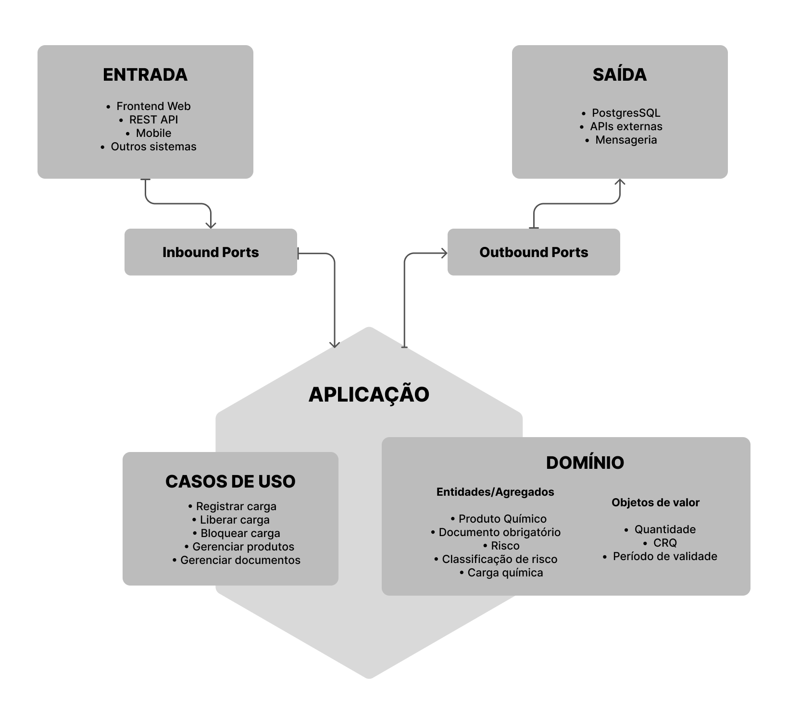

# Decisões arquiteturais

## Arquitetura adotada

A **Arquitetura Hexagonal**, que atua com POrts e Adapters, tem o objetivo de separar as responsabilidades da aplicação, reduzir o acoplamento entre as camadas e facilitar sua evolução ao longo das próximas etapas do projeto. Por esse motivo, esse foi o modelo de arquitetura adotado para desenvolvermos o QuimiPort.

## Benefícios e tradeoffs

Nesse cenário, as regras de negócio serão concentradas no domínio da aplicação. Isso garante que as regras permaneçam independentes da infraestrutura utilizada no sistema. COmo tradeoff, isso exige um esforço maior ao modelar e definir essas abstrações no início do desenvolvimento.

## Evolução do projeto

No caso da arquitetura Hexagonal, cada módulo pode ser incluído como um novo ccaso de uso no núcleo da aplicação, reutilizando entidades e regras de negócio já existentes. Desse modo, é possível adicionar novas funcionalidades sem alterar o domínio da aplicação

### Backend

O backend será desenvolvido utilizando Node.js com NestJS, adotando uma estrutura modular que facilite a separação de responsabilidades e a evolução da aplicação. O NestJS será utilizado para estruturar a camada de aplicação e as integrações necessárias, mantendo as regras de negócio isoladas conforme a Arquitetura Hexagonal.

### Frontend

O frontend será desenvolvido utilizando React, permitindo a construção de uma interface modular e componentizada. A aplicação consumirá os recursos disponibilizados pelo backend, mantendo a camada de apresentação desacoplada das regras de negócio do domínio.

### Mobile

A aplicação mobile será desenvolvida utilizando React Native, possibilitando o reaproveitamento de conhecimentos e conceitos utilizados no frontend web. Essa escolha também permite que a solução seja expandida para dispositivos móveis sem alterar o núcleo de regras de negócio da aplicação.

### Microsserviços

À medida que o sistema crescer, alguns contextos poderão ser extraídos para serviços independentes, como:

- Serviço de Gestão de Produtos Químicos;
- Serviço de Gestão de Cargas;
- Serviço de Documentação;
- Serviço de Inspeções;
- Serviço de Notificações.

### Estrutura de pastas

```
src/
│
├── modules/
│   │
│   ├── cargas/
│   │   ├── domain/
│   │   │   ├── entities/
│   │   │   ├── value-objects/
│   │   │   ├── aggregates/
│   │   │   ├── services/
│   │   │   ├── errors/
│   │   │   └── events/
│   │   │
│   │   ├── application/
│   │   │   ├── use-cases/
│   │   │   ├── dto/
│   │   │   └── ports/
│   │   │
│   │   └── infrastructure/
│   │       ├── adapters/
│   │       │   ├── inbound/
│   │       │   └── outbound/
│   │       └── persistence/
│   │
│   ├── produtos/
│   │   ├── domain/
│   │   ├── application/
│   │   └── infrastructure/
│   │
│   ├── inspecoes/
│   │   ├── domain/
│   │   ├── application/
│   │   └── infrastructure/
│   │
│   └── documentacao/
│       ├── domain/
│       ├── application/
│       └── infrastructure/
│
├── shared/
│   ├── domain/
│   └── infrastructure/
│
└── main.ts
```

### Camadas da aplicação



#### Domínio

Responsável por representar os conceitos e regras centrais do QuimiPort.

Contém:

- Entidades;
- Agregados;
- Value Objects;
- Regras de negócio;
- Serviços de domínio;
- Eventos de domínio, quando aplicável.

O domínio não possui dependência de banco de dados, frameworks, APIs externas ou interfaces de usuário.

#### Aplicação

Responsável por orquestrar os casos de uso do sistema.

Contém:

- Casos de uso;
- DTOs;
- Interfaces das Ports;
- Orquestração das operações.

A camada de aplicação utiliza o domínio para executar as operações e acessa recursos externos exclusivamente por meio das Ports.

#### Ports

As Ports definem os contratos utilizados para comunicação entre o núcleo da aplicação e o ambiente externo.

##### Inbound Ports

Representam os contratos de entrada dos casos de uso.

Exemplos:

- RegistrarCarga;
- LiberarCarga;
- BloquearCarga;
- ConsultarCarga.

##### Outbound Ports

Representam os contratos necessários para acessar recursos externos.

Exemplos:

- CargaRepository;
- ProdutoRepository;
- DocumentoRepository;
- StorageGateway.

#### Adapters

Os Adapters implementam a comunicação com tecnologias externas.

##### Adapters de entrada

- Controllers REST;
- Interfaces de API;
- Futuramente, aplicações web e mobile.

##### Adapters de saída

- PostgreSQL;
- Serviços de armazenamento de arquivos;
- APIs externas;
- Serviços de mensageria, quando necessários.

#### Infraestrutura

Responsável pelas implementações concretas dos recursos externos e configurações técnicas da aplicação.

Essa camada não deve conter regras de negócio.

## JavaScript Avançado e TypeScript

O QuimiPort utilizará TypeScript e recursos modernos do JavaScript para garantir uma aplicação mais segura, organizada e preparada para evolução. A tipagem forte será utilizada para representar os conceitos do domínio de forma clara, enquanto interfaces, classes e tipos específicos ajudarão a manter contratos bem definidos entre os componentes.

### Tipagem 

O TypeScript será utilizado para representar explicitamente os conceitos do domínio, evitando o uso excessivo de tipos genéricos. Isso contribui para reduzir erros, facilitar a manutenção e tornar os contratos da aplicação mais claros.

```ts
interface CargaQuimica {
  id: string;
  quantidade: Quantidade;
  status: StatusCarga;
}
```

### Interfaces

As interfaces serão utilizadas principalmente para definir contratos entre componentes, especialmente nas **Ports** da Arquitetura Hexagonal. Dessa forma, a aplicação não ficará diretamente acoplada às implementações de infraestrutura.

```ts
interface CargaRepository {
  buscarPorId(id: string): Promise<CargaQuimica>;
  salvar(carga: CargaQuimica): Promise<void>;
}
```

### Classes

As classes serão utilizadas quando um objeto possuir comportamento e regras próprias, principalmente em entidades, agregados e Value Objets do domínio. Dessa forma, as regras de negócio podem ser protegidas pelo próprio domínio.

Por exemplo, em vez de alterar diretamente o status de uma carga, a entidade poderá controlar a operação:

```ts
carga.liberar();
```

### Enums e tipos para status e classificações

Valores que possuem um conjunto previamente definido serão representados por tipos específicos, evitando valores arbitrários e facilitando a validação durante o desenvolvimento.

```ts
type StatusCarga =
  | 'REGISTRADA'
  | 'BLOQUEADA'
  | 'LIBERADA'
  | 'CANCELADA';
```

Essa abordagem será aplicada principalmente a status, classificações de risco e outros estados controlados pelo domínio.

### Funções puras para validações

Validações que não dependem de estado externo poderão ser implementadas como funções puras. Isso torna seu comportamento previsível e facilita a criação de testes unitários.

```ts
function quantidadeValida(valor: number): boolean {
  return valor > 0;
}
```

### Módulos ES6+

A aplicação será organizada utilizando módulos ES6+, com `import` e `export`, mantendo cada parte do sistema com responsabilidades bem definidas. Essa organização contribui para o baixo acoplamento e facilita a reutilização dos componentes.

### Async/Await

O `async/await` será utilizado em operações assíncronas, principalmente em futuras integrações com APIs, bancos de dados e outros serviços externos. A abordagem facilita a leitura do código e o tratamento de erros em operações assíncronas.

### Generics

Generics serão utilizados quando houver necessidade de criar estruturas reutilizáveis que mantenham a tipagem dos dados. Seu uso será aplicado de forma pontual, evitando complexidade desnecessária.

### Tratamento de erros

Os erros serão tratados de forma consistente, diferenciando erros relacionados às regras de negócio de falhas de infraestrutura ou integração. No domínio, regras inválidas poderão gerar erros específicos, enquanto as camadas externas serão responsáveis por traduzir esses erros para respostas adequadas.

### Contratos e tipos compartilhados

Os contratos e tipos utilizados por diferentes partes da aplicação serão organizados de forma centralizada e controlada, evitando duplicação e divergência entre componentes. Essa organização será especialmente importante para as interfaces das Ports e para os contratos de comunicação entre módulos.